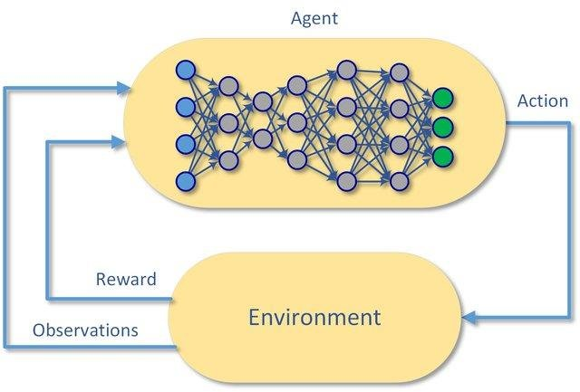
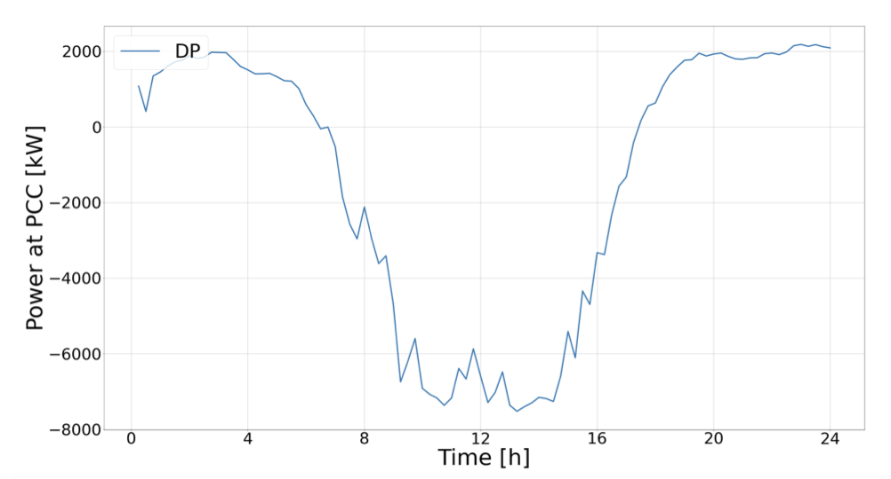

## Semester Project

# Abstract

In this project, we evaluate the performances of the Soft Actor Critic algorithm for computing a dispatch plan in a medium size radial distribution grid. Using a reinforcement learning algorithm to solve this task has already been proved to be a valid alternative to the standard optimization method involving the computation of the AC Optimal Power Flow. In particular, it has been shown that the DDPG (Deep Deterministic Policy Gradient) algorithm in the actor critic framework is able to compute a reliable and efficient day-ahead dispatch plan. However, the DDPG algorithm suffers from some instability issues. When training an agent multiple times, with the same data and the same parameters, not all agents reaches the same quality. The goal of this thesis is to show that the state-of-the-art Soft Actor Critic Algorithm can actually achieve a more stable performances in terms of the computation of the dispatch plan. Since the standard SAC algorithm is designed for an online interaction with the en- vironment, we need to design a tailored methodology to compute a day-ahead dispatch plan. In this work, we compute a dispatch plan for a real electrical network, equipped with PV generation plants and with a battery. The com- puted dispatch plan is then validated using a real-time controller which tries to follow the plan as closely as possible. Finally, the obtained results are compared to those achieved with the DDPG reinforcement learning algorithm and with CoDistFlow, an optimization based scheme method.

   &nbsp;&nbsp;&nbsp;&nbsp;&nbsp;&nbsp;&nbsp;&nbsp;&nbsp;&nbsp;
  

*On the left, a simple representation of a Deep Reinforcement Learning algorithm. On the right, the final learned dispatch plan.*

